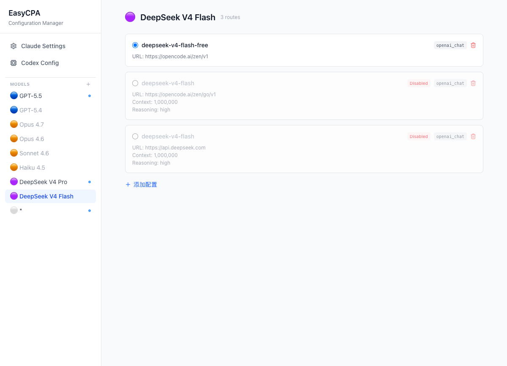

# EasyCPA

Easy use CPA proxy for Claude Code & Codex.
Use opencode go/deepseek in claude code/codex.Use gpt in claude code.



本项目解决四个问题（目前没有成熟项目能同时解决,只好AI搓一个）：

1. **传统 OpenAI Chat 端点在 Codex / Claude Code 中使用** 
2. **GPT-5.4 等 OpenAI Responses 端点在 Claude Code 中使用**
3. **DeepSeek reasoning_content / image 补丁** 
4. **转换后缓存正常命中** 

代码整合了 [cc-switch](https://github.com/farion1231/cc-switch)、[CPA](https://github.com/samueltuyizere/oc-go-cc) 等项目，用 Claude Code 改写。目前仅在mac上简单测试，个人使用正常。

配置文件的思路是面向模型而非面向provider，看上去麻烦但有最大的灵活性，和droid的模型配置相似。

> **为什么要自己写配置文件？** 详见 [why-self-manage-config.md](docs/why-self-manage-config.md)

不支持故障转移，不支持轮询，不支持供应商配置。

一个模型可以有N个配置，手动选择哪个生效。

## Quick Start

```bash
# 1. 下载 release 并解压
unzip easycpa-*-macos-arm64.zip

# 2. 复制示例配置并修改 API Key 和端点
cp config.json.sample config.json

# 3. macOS 首次运行需移除隔离标记
xattr -d com.apple.quarantine easycpa

# 4. 启动（后台守护模式）
./easycpa start
```

客户端设置：
- Claude Code 端点：`http://127.0.0.1:15791`
- Codex 端点：`http://localhost:15791/v1`

## 配置

配置文件路径（按优先级）：
1. 可执行文件同目录的 `config.json`
2. `~/.easycpa/config.json`

```json
{
  "models": [
    {
      "name": "deepseek-v4-flash-free",
      "model": "deepseek-v4-flash-free",
      "base_url": "https://opencode.ai/zen/v1",
      "api_key": "sk-xxx",
      "api_format": "openai_chat",
      "context_window": 1000000,
      "max_output_tokens": 384000,
      "default_reasoning_level": "high",
      "supported_reasoning_levels": ["low", "medium", "high", "xhigh"],
      "supports_parallel_tool_calls": true,
      "supports_reasoning_summaries": true
    },
    {
      "name": "gpt-5.5",
      "model": "deepseek-v4-pro",
      "base_url": "https://opencode.ai/zen/go/v1",
      "api_key": "sk-xxx",
      "api_format": "openai_chat",
      "context_window": 1000000,
      "max_output_tokens": 384000,
      "default_reasoning_level": "high",
      "supported_reasoning_levels": ["low", "medium", "high", "xhigh"],
      "supports_parallel_tool_calls": true,
      "supports_reasoning_summaries": true
    },
    {
      "name": "gpt-5.4",
      "model": "gpt-5.4",
      "base_url": "chatgpt.com",
      "api_key": "read_codex_auth",
      "proxy_url": "http://127.0.0.1:7890",
      "api_format": "openai_responses"
    },
    {
      "name": "*",
      "model": "*",
      "base_url": "https://localhost/v1",
      "api_key": "sk-xxx",
      "api_format": "openai_chat"
    }
  ],
  "listen": "127.0.0.1:15791"
}
```

### Codex OAuth（ChatGPT Plus/Pro）

使用 ChatGPT 订阅的 GPT 模型，无需 API Key。前提是已安装 [Codex CLI](https://github.com/openai/codex) 并完成登录（`codex` 登录后会生成 `~/.codex/auth.json`）。

配置方式：将 `api_key` 设为 `"read_codex_auth"`，`base_url` 设为 `"chatgpt.com"`：

```json
{
  "name": "gpt-5.4",
  "model": "gpt-5.4",
  "base_url": "chatgpt.com",
  "api_key": "read_codex_auth",
  "api_format": "openai_responses"
}
```

EasyCPA 会自动读取 `~/.codex/auth.json` 中的 access_token 和 account_id。**不支持登录、刷新或登出**，请使用 `codex` CLI 管理认证。

如果网络无法直连 `chatgpt.com`，可通过 `proxy_url` 指定代理：

```json
{
  "name": "gpt-5.4",
  "model": "gpt-5.4",
  "base_url": "chatgpt.com",
  "api_key": "read_codex_auth",
  "proxy_url": "http://127.0.0.1:7890",
  "api_format": "openai_responses"
}
```

### Per-Route 代理

每条路由可独立配置代理（HTTP/SOCKS5），不使用系统环境变量代理。不设 `proxy_url` 则直连。

```json
{
  "name": "my-model",
  "model": "my-model",
  "base_url": "https://api.example.com/v1",
  "api_key": "sk-xxx",
  "proxy_url": "socks5://127.0.0.1:1080",
  "api_format": "openai_chat"
}
```


> 以下内容由 AI 生成

### ModelRoute 字段说明

| 字段 | 必填 | 说明 |
|------|------|------|
| `name` | 否 | 路由名称，客户端请求的 model 字段匹配此项，默认等于 model |
| `model` | 是 | 实际转发给上游的模型名 |
| `base_url` | 是 | 上游 API 地址 |
| `api_key` | 是 | API 密钥，或 `"read_codex_auth"` 使用 Codex OAuth |
| `api_format` | 否 | API 格式：`openai_chat`（默认）/ `openai_responses` / `anthropic` |
| `proxy_url` | 否 | 该路由的代理地址（HTTP/SOCKS5），不设则直连，不读取系统环境变量 |
| `context_window` | 否 | 上下文窗口大小，用于 /v1/models 返回（Codex） |
| `max_output_tokens` | 否 | 最大输出 token 数（Codex） |
| `default_reasoning_level` | 否 | 默认推理级别（Codex） |
| `supported_reasoning_levels` | 否 | 支持的推理级别列表（Codex） |
| `supports_parallel_tool_calls` | 否 | 是否支持并行工具调用（Codex） |
| `supports_reasoning_summaries` | 否 | 是否支持推理摘要，Codex 发送 reasoning_effort 的门控开关 |

`name: "*"` 为通配路由，匹配所有未命中的模型请求。

`enabled` 字段控制路由启用状态，同一 `name` 只允许一条 `enabled: true` 的路由。

**配置热载**：修改 `config.json` 后无需重启，EasyCPA 会自动检测文件变更并重新加载路由配置。通过 Web UI 修改配置同样即时生效。

## 管理界面

启动后浏览器打开 `http://127.0.0.1:15791` 即可使用 Web UI 管理配置：


## 核心能力

### 多格式自动转换

| 客户端 | 请求格式 | 上游格式 | 转换模块 |
|--------|---------|---------|---------|
| Claude Code | Anthropic Messages | OpenAI Chat | `transform.rs` |
| Codex CLI | OpenAI Responses | OpenAI Chat | `transform_responses_chat.rs` |
| Claude Code | Anthropic Messages | OpenAI Responses | `transform_responses.rs` |

所有转换均为双向：请求方向自动转换格式，响应方向（含 SSE 流式）同步转换回客户端期望的格式。

### 流式 SSE 转换

- Chat Completions SSE → Anthropic Messages SSE（Claude Code 路径）
- Chat Completions SSE → OpenAI Responses SSE（Codex 路径）
- 流式首字超时 / 静默超时 / 非流式总超时，三重超时保护

### 故障转移 & 熔断器

- 自动故障转移：请求失败时尝试下一个可用 provider
- 三态熔断器（Closed → Open → HalfOpen）：连续失败自动熔断，恢复期放行试探请求
- 故障转移去重：多个并发请求不会重复触发切换
- 每个应用独立熔断状态，互不干扰

### 429 退避重试

- 单 Provider 场景下 429 不直接返回给客户端
- 自动退避重试（2s → 4s → 8s，最多 3 次）
- 避免客户端（如 Codex）立即重试导致恶性循环

### Thinking 优化 & 整流

- **Thinking 优化器** — 根据模型自动选择最佳 thinking 策略
- **Thinking 签名整流器** — 上游返回签名校验错误时，自动移除问题 signature 字段并重试
- **Thinking Budget 整流器** — 上游返回 budget_tokens 约束错误时，自动调整参数并重试
- **Cache 断点注入** — 自动在 tools/system/user 关键位置注入 `cache_control` 断点，启用 Prompt Caching

### 图片处理

- Codex vision-ability 发送的 base64 图片，自动保存为本地文件（`/tmp/easycpa-images/`）
- 使用内容 SHA256 hash 作为文件名，同一图片始终映射到同一文件，不重复保存
- 不支持图片的上游（如 DeepSeek）不会收到 `image_url` 类型的 `unknown variant` 错误

### Reasoning Effort 映射

- DeepSeek 模型自动映射 reasoning_effort：`xhigh → max`，`low/medium → high`
- 对没有 reasoning_content 问题的端点无副作用

### /v1/models 端点

- 返回 Codex ModelInfo 格式（`{ models: [ModelInfo] }`）
- 支持 `supported_reasoning_levels`、`supports_reasoning_summaries`、`supports_parallel_tool_calls`、`context_window`、`max_output_tokens` 等完整字段
- `supports_reasoning_summaries = true` 是 Codex 发送 reasoning_effort 的门控开关

## 支持的客户端

| 客户端 | 接入方式 |
|--------|---------|
| Claude Code | Anthropic Messages API (`/v1/messages`) |
| Codex CLI | OpenAI Responses API (`/v1/responses`) |
| OpenCode | OpenAI Chat/Responses API |
| OpenClaw | OpenAI Chat API |

## API 端点

```
GET  /health                    — 健康检查
GET  /status                    — 代理状态
GET  /v1/models                 — 模型列表（Codex ModelInfo 格式）
POST /v1/messages               — Anthropic Messages API
POST /claude/v1/messages        — Claude Desktop Messages API
POST /v1/chat/completions       — OpenAI Chat Completions API
POST /chat/completions          — OpenAI Chat Completions API
POST /v1/responses              — OpenAI Responses API
POST /codex/v1/responses        — Codex Responses API
```

## CLI 命令

```
easycpa start              # 启动守护进程（默认，自动后台运行）
easycpa start --foreground # 前台运行（开发调试用）
easycpa start --no-open    # 启动但不打开浏览器
easycpa start --port 8080  # 覆盖监听端口
easycpa stop               # 停止守护进程
easycpa restart            # 重启守护进程
easycpa reload             # 热重载配置（不重启）
easycpa status             # 查看运行状态
```

不带参数运行等同于 `easycpa start`。

## 编译 & 运行

```bash
cargo build --release
./target/release/easycpa start
```

开发模式（前台运行）：

```bash
RUST_LOG=debug cargo run -- start --foreground
```

macOS 下载 release 二进制后首次运行可能提示"无法验证开发者"，执行：

```bash
xattr -d com.apple.quarantine easycpa-aarch64-apple-darwin
```

## 技术栈

- **语言**: Rust (edition 2021, MSRV 1.85)
- **HTTP 框架**: axum + hyper
- **异步运行时**: tokio
- **序列化**: serde + serde_json
- **CLI**: clap
- **数据库**: rusqlite（provider 配置、usage 统计、熔断器状态持久化）
- **加密/哈希**: sha2

## 代码来源

本项目从 [cc-switch](https://github.com/farion1231/cc-switch)（MIT License, © Jason Young）提取并独立演化。

核心代理逻辑（格式转换、流式 SSE、熔断器、Thinking 优化/整流等）源自 cc-switch 的 `src-tauri/src/proxy/` 模块，重构为独立 CLI 工具时移除了 Tauri 桌面端依赖，并新增了以下功能：

- Codex Responses → OpenAI Chat 格式转换（`transform_responses_chat.rs`、`streaming_chat_to_responses.rs`）
- Chat SSE → Responses SSE 流式转换
- Reasoning 内容处理（DeepSeek reasoning_content → Responses reasoning item）
- 多 function_call 合并到同一 assistant 消息
- 连续 assistant 消息合并修复
- 429 退避重试
- 独立 CLI 入口（clap）

## License

MIT
